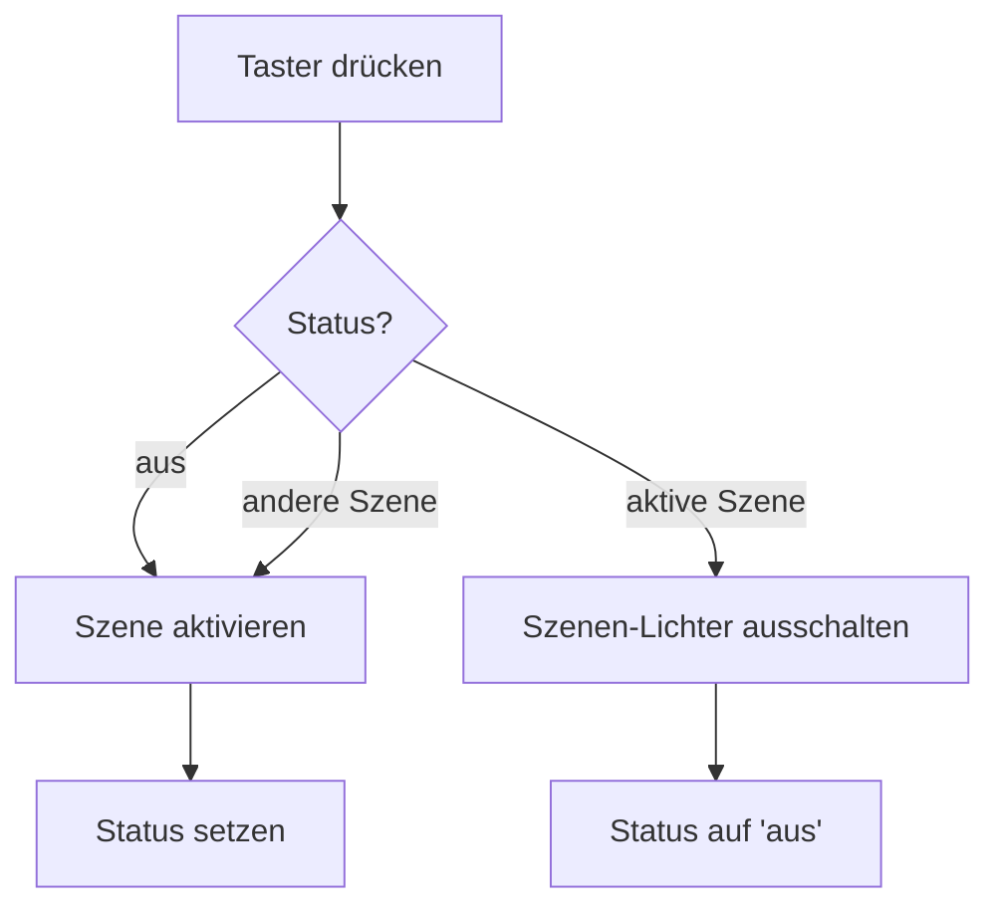

# KNX Intelligente Lichtsteuerung Blueprint für Home Assistant

[](https://www.home-assistant.io/)
[](https://www.home-assistant.io/integrations/knx/)
[](https://github.com/chrisrocks177/ha_intelligent_light_control/releases)
[](LICENSE)

[](https://www.buymeacoffee.com/chrisrocks)

Professionelle KNX-Lichtsteuerung mit szenenbasiertem Ausschalten, Toggle-Funktion und intelligenter Tag/Nacht-Automatik.

## 🎯 Hauptfunktionen

- **3 KNX-Taster mit Toggle-Funktion**
  - 🔆 Tagbeleuchtung
  - 🌙 Nachtbeleuchtung  
  - 🔄 Automatische Tag/Nacht-Auswahl
  - Toggle: Erneutes Drücken schaltet die aktive Szene aus

- **Szenenbasiertes Ausschalten (NEU in v1.1.0)**
  - Schaltet nur Lichter aus, die in der aktiven Szene enthalten sind
  - Löst das "geteilte Lampen"-Problem (Lampe beleuchtet mehrere Räume)
  - Präziser und flexibler als gruppenbasiertes Ausschalten

- **Optionale Funktionen**
  - ⏻ Vierter "Alles Aus" Taster
  - 📡 KNX Status-Rückmeldung für Taster-LEDs
  - 🚶 Durchgangslicht mit Präsenzmelder
  - ⏲️ 2-stufige Langzeit-Abwesenheitserkennung

## 📋 Voraussetzungen

- Home Assistant mit [KNX-Integration](https://www.home-assistant.io/integrations/knx/)
- Binary Sensor für Tag/Nacht-Erkennung (z.B. basierend auf Sonnenstand)
- Szenen für Tag- und Nachtbeleuchtung
- Input Select Helper mit Optionen: `aus`, `tag`, `nacht`, `durchgang`

## 🚀 Installation

### Methode 1: Import über URL (empfohlen)

1. Öffne Home Assistant
2. Gehe zu **Einstellungen** → **Automationen & Szenen** → **Blueprints**
3. Klicke auf **Blueprint importieren**
4. Füge diese URL ein:
   ```
   https://github.com/chrisrocks177/ha_intelligent_light_control /blob/main/light_control_day_night.yaml
   ```
5. Klicke auf **Vorschau** und dann auf **Importieren**

### Methode 2: Manuelle Installation

1. Lade die Datei `light_control_day_night.yaml` herunter
2. Kopiere sie in dein Home Assistant Blueprint-Verzeichnis:
   ```
   config/blueprints/automation/chrisrocks177/
   ```
3. Starte Home Assistant neu oder lade die Blueprints neu

## 📖 Schnellstart

### 1. Erstelle einen Input Select Helper

Gehe zu **Einstellungen** → **Geräte & Dienste** → **Helfer** → **Helfer erstellen**

```yaml
Status Wohnzimmer Licht:
  Optionen:
    - aus
    - tag
    - nacht
    - durchgang
```

### 2. Erstelle deine Szenen

Beispiel für Tag-Szene:
```yaml
scene.wohnzimmer_tag:
  entities:
    light.wohnzimmer_decke:
      state: on
      brightness: 255
    light.wohnzimmer_stehlampe:
      state: on
      brightness: 200
```

⚠️ **WICHTIG:** Stelle sicher, dass ALLE relevanten Lichter in der Szene enthalten sind!

### 3. Erstelle eine Automation aus dem Blueprint

1. Gehe zu **Einstellungen** → **Automationen & Szenen**
2. Klicke auf **Automation erstellen** → **Blueprint verwenden**
3. Wähle "Lichtsteuerung mit Tag- und Nachtmodus"
4. Konfiguriere die KNX-Gruppenadressen und Szenen

## 🔧 Konfiguration

### Pflichtfelder

| Feld | Beschreibung | Beispiel |
|------|--------------|----------|
| Taster Tagbeleuchtung | KNX-Gruppenadresse | `1/2/1` |
| Taster Nachtbeleuchtung | KNX-Gruppenadresse | `1/2/2` |
| Taster Automatik | KNX-Gruppenadresse | `1/2/3` |
| Tag/Nacht Sensor | Binary Sensor | `binary_sensor.daytime` |
| Szene Tag | Home Assistant Szene | `scene.wohnzimmer_tag` |
| Szene Nacht | Home Assistant Szene | `scene.wohnzimmer_nacht` |
| Status Helper | Input Select | `input_select.wz_status` |
| Lichtgruppe | Light Group | `light.wohnzimmer` |

### Optionale Felder

Wenn du ein Feature nicht nutzen möchtest:
- **KNX-Gruppenadressen:** Lasse `31/7/255` stehen
- **Entitäten:** Lasse `sun.sun` ausgewählt

Siehe [Vollständige Dokumentation](https://claude.ai/share/1f56ef21-4bf0-41ae-ac3f-c0c44bb98d26) für Details zu allen Feldern.

## 💡 Funktionsweise

### Toggle-Logik



### Szenenbasiertes Ausschalten

**Problem:** Geteilte Lampen
```
Deckenlampe beleuchtet Wohnzimmer UND Esszimmer
❌ Altes System: Gruppenbasiert → Lampe geht immer aus
✅ Neues System: Szenenbasiert → Nur wenn in Szene
```

**Lösung:**
1. Blueprint ermittelt aktive Szene
2. Liest Lichtliste aus Szenen-Attributen
3. Schaltet nur diese Lichter aus

## 📦 Unterstützte Entitäten

Das Blueprint unterstützt beim Ausschalten:
- ✅ `light.*` - Lichter
- ✅ `switch.*` - Schalter
- ✅ `fan.*` - Ventilatoren
- ✅ `plug.*` - Steckdosen
- ✅ Alle Entitäten mit `turn_off` Service

Siehe [SWITCH_SUPPORT.md](SWITCH_SUPPORT.md) für Details.

## 🔄 Update von v1.0.0 auf v1.1.0

Siehe [UPDATE_V1.1.0.md](UPDATE_V1.1.0.md) für einen detaillierten Migrations-Guide.

**Wichtigste Schritte:**
1. Prüfe alle Szenen auf Vollständigkeit
2. Teste Toggle-Funktion für jede Szene
3. Bei Problemen: Fehlende Lichter zur Szene hinzufügen

## 📚 Dokumentation

- [CHANGELOG.md](CHANGELOG.md) - Vollständige Versionshistorie
- [SWITCH_SUPPORT.md](SWITCH_SUPPORT.md) - Switch/Plug Unterstützung
- [UPDATE_V1.1.0.md](UPDATE_V1.1.0.md) - Migrations-Guide

## 🐛 Problembehandlung

### Lichter gehen beim Toggle nicht aus

**Ursache:** Lichter fehlen in der Szene

**Lösung:**
1. Öffne die Szene in Home Assistant
2. Überprüfe die enthaltenen Entitäten
3. Füge fehlende Lichter hinzu

### KNX-Taster reagiert nicht

**Prüfungen:**
1. KNX-Integration läuft?
2. Gruppenadresse korrekt formatiert? (X/Y/Z)
3. Taster sendet Telegram? (KNX-Monitor prüfen)

### Durchgangslicht aktiviert sich nicht

**Prüfungen:**
1. Präsenzmelder-Status korrekt?
2. Override-Entitäten auf "off"?
3. KNX-Sensor Nachlaufzeit konfiguriert?

## 🤝 Beitragen

Contributions sind willkommen! 

1. Fork das Repository
2. Erstelle einen Feature-Branch (`git checkout -b feature/AmazingFeature`)
3. Commit deine Änderungen (`git commit -m 'Add some AmazingFeature'`)
4. Push zum Branch (`git push origin feature/AmazingFeature`)
5. Öffne einen Pull Request

### Entwicklungsrichtlinien

- Code sollte dem Home Assistant Blueprint Standard folgen
- Neue Features sollten dokumentiert werden
- Changelog muss aktualisiert werden
- Tests für kritische Funktionen

## 📝 Lizenz

Dieses Projekt ist unter der MIT-Lizenz lizenziert - siehe [LICENSE](LICENSE) Datei für Details.

## 🙏 Credits

Entwickelt für die Home Assistant Community mit Fokus auf professionelle KNX-Integration.

## 📞 Support

- **Issues:** [GitHub Issues](https://github.com/chrisrocks177/ha_intelligent_light_control /issues)
- **Diskussionen:** [GitHub Discussions](https://github.com/chrisrocks177/ha_intelligent_light_control /discussions)
- **Home Assistant Forum:** [Community Forum](https://community.home-assistant.io/)

## 🗺️ Roadmap

### Version 1.2.0 (geplant)
- [ ] Mehrere Lichtgruppen pro Raum
- [ ] Zeitbasierte Automatisierungen
- [ ] Saisonale Anpassungen

### Version 1.3.0 (geplant)
- [ ] Web-UI für einfachere Konfiguration
- [ ] Vorlagen für häufige Szenarien
- [ ] Import/Export von Konfigurationen

---

**Entwickelt mit ❤️ für die Home Assistant Community**

⭐ Wenn dir dieses Blueprint gefällt, gib dem Repository einen Star!
